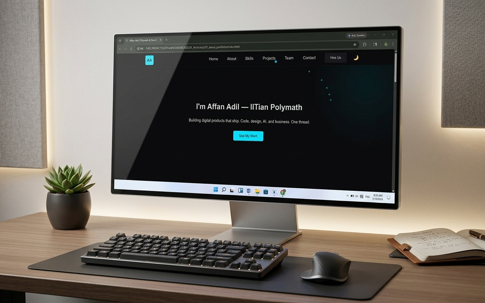
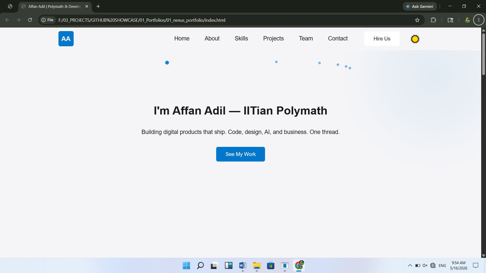
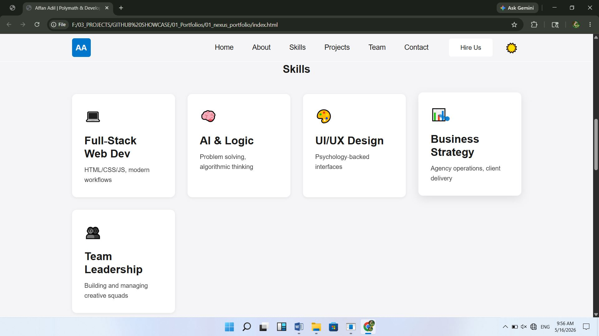
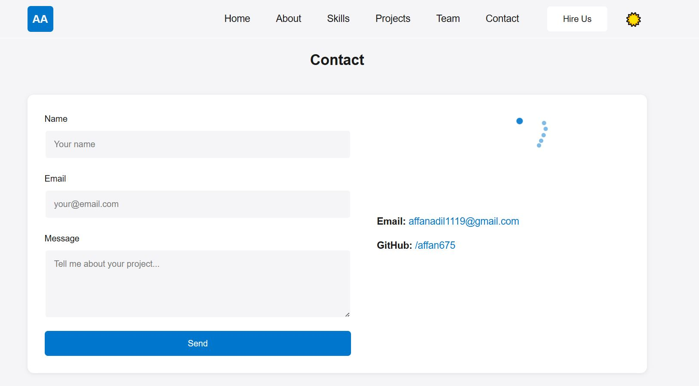

<div align="center">

# ✨ Nexus Portfolio

### A Modern, Production-Ready Portfolio Website  
**Built with Pure HTML, CSS & Vanilla JavaScript**

[View Live](#-live-demo) · [Documentation](#-documentation) · [Report Bug](https://github.com/affan675/01_nexus_portfolio/issues) · [Contribute](#-contributing)

</div>

---

## 📊 Badges

<div align="center">


</div>

---

## 📋 About This Project

**Nexus Portfolio** is a premium, production-ready single-page portfolio website that showcases modern web design principles with zero external dependencies. Built entirely from scratch using vanilla JavaScript, CSS3, and semantic HTML5, it serves as both a portfolio template and a reference for clean, performant web development.

> Perfect for developers, designers, and creative professionals who want a fast-loading, accessible, and visually stunning portfolio that's truly **theirs**.

---

## 🚀 Live Demo

> **Live Demo:** https://affan675.github.io/02_password_manager/

---

## ✨ Key Features

### 🎨 Design & UX
- **✓ Single-page design** with smooth scrolling and intuitive navigation
- **✓ Dark/Light theme toggle** with persistent localStorage preferences
- **✓ Fully responsive** across all devices (mobile, tablet, desktop)
- **✓ Fluid typography** using CSS `clamp()` for perfect scaling
- **✓ Smooth scroll animations** using Intersection Observer API
- **✓ Custom cursor** with trailing effect (disabled on touch devices)

### 🔧 Technical Excellence
- **✓ Zero dependencies** — no npm packages, frameworks, or build tools required
- **✓ Instant load** — open `index.html` directly in your browser
- **✓ Optimized preloader** with animated SVG and shimmer progress bar
- **✓ Mobile-first hamburger menu** with pure CSS + minimal JavaScript
- **✓ Tab visibility detection** with dynamic title changes
- **✓ Accessibility-first** — semantic HTML, ARIA labels, keyboard navigation

### 📱 Responsiveness
- **Mobile-optimized** layouts at breakpoints: 480px, 768px, and up
- **Touch-friendly** interactions and enlarged tap targets
- **Performance-optimized** — minimal repaints and reflows

---

## 📸 Screenshots

<div align="center">

### 🌙 Dark Theme - Home Section


### ☀️ Light Theme - Home Section


### 💼 Skills Section


### 📧 Contact Section


</div>

---

## 🛠️ Tech Stack

| Layer | Technology | Version |
|-------|-----------|---------|
| **Frontend** | HTML5 | 5 |
| **Styling** | CSS3 | 3 (with Custom Properties) |
| **Scripting** | Vanilla JavaScript | ES6+ |
| **Typography** | Google Fonts | Latest |
| **Build Tool** | None | Zero-dependency |
| **Package Manager** | None | Not required |

### Fonts & Libraries
- **Headings:** Space Grotesk (400, 500, 700)
- **Body Text:** Inter (400, 500, 700)
- **Monospace:** JetBrains Mono (400, 500, 700)
- **External:** Google Fonts (CDN)

---

## ⚡ Quick Start

### Installation

```bash
# Option 1: Clone the repository
git clone https://github.com/affan675/01_nexus_portfolio.git
cd nexus-portfolio

# Option 2: Download as ZIP
# Extract the zip file and navigate to the directory
```

### Usage

```bash
# Simply open the file in your browser
# macOS
open index.html

# Windows
start index.html

# Linux
xdg-open index.html

# Or manually open in browser
# Right-click index.html → Open with Browser
```

**That's it!** No `npm install`, no build steps, no server required. ✨

---

## 📂 Folder Structure

```
nexus-portfolio/
├── 📄 index.html                 # Main HTML file (open this!)
│
├── 📁 css/                       # Organized modular stylesheets
│   ├── base.css                  # Global styles, resets, CSS variables
│   ├── layout.css                # Grid/flexbox layouts
│   ├── components.css            # Reusable component styles
│   ├── animations.css            # Scroll & interactive animations
│   └── responsive.css            # Mobile breakpoints
│
├── 📁 js/                        # Modular JavaScript modules
│   ├── app.js                    # Main application logic
│   ├── cursor.js                 # Custom cursor behavior
│   └── loading.js                # Preloader logic
│
├── 📁 assets/                    # Static assets
│   └── screenshots/              # Portfolio screenshots
│       ├── home_night.png
│       ├── home_day.JPG
│       ├── skills.JPG
│       └── contact.JPG
│
├── 📄 README.md                  # Documentation (this file)
└── 📄 LICENSE                    # MIT License

```

---

## 🎨 Design System

### Color Palette

| Element | Dark Theme | Light Theme |
|---------|-----------|------------|
| **Background** | `#0a0a0c` | `#f5f5f7` |
| **Surface** | `#16161a` | `#ffffff` |
| **Text** | `#e0e0e0` | `#1a1a1a` |
| **Accent** | `#00e5ff` (Cyan) | `#0077cc` (Blue) |
| **Secondary** | `#ffb300` (Orange) | `#c77d00` (Gold) |

### Typography System

| Element | Font | Weight | Size |
|---------|------|--------|------|
| **H1 (Title)** | Space Grotesk | 700 | `clamp(2rem, 8vw, 4rem)` |
| **H2 (Section)** | Space Grotesk | 600 | `clamp(1.5rem, 6vw, 2.5rem)` |
| **H3 (Subheading)** | Space Grotesk | 500 | `clamp(1rem, 4vw, 1.5rem)` |
| **Body Text** | Inter | 400 | `clamp(0.875rem, 2vw, 1rem)` |
| **Code** | JetBrains Mono | 400 | `0.875rem` |

---

## 🔧 Technical Implementation

### Preloader System
```javascript
// Ensures branding consistency on page load
// - Minimum 1.5 second display
// - Triggers after window.load + components-ready event
// - Prevents FOUC (Flash of Unstyled Content)
```

### Theme Toggle Architecture
- Uses `data-theme` attribute on `<body>` element
- CSS variables adapt instantly to theme changes
- User preference persisted via localStorage
- Respects system theme preference on first visit

### Responsive Design
- **Mobile First** approach: baseline styles for small screens
- **Breakpoints:** 480px (tablets), 768px (desktops), 1200px+ (large displays)
- **Fluid Typography:** `clamp()` function ensures perfect scaling
- **Touch Optimization:** Tap targets minimum 44px × 44px

### Accessibility Features
- Semantic HTML5 structure
- ARIA labels for interactive elements
- Keyboard navigation support (Tab, Enter, Escape)
- Focus indicators on interactive elements
- Alt text for all images
- Color contrast ratios meet WCAG AA standards

---

## 📖 Usage Guide

### Customizing the Content

1. **Edit `index.html`**
   - Update personal information
   - Modify section content and projects
   - Add your social media links

2. **Update Styles**
   - Theme colors in `css/base.css` (CSS variables)
   - Adjust fonts in `css/base.css`
   - Modify component appearance in `css/components.css`

3. **Add Images**
   - Place images in `assets/` folder
   - Reference paths relative to `index.html`
   - Optimize images for web (compress before uploading)

### Advanced Configuration

**Custom CSS Variables:**
```css
:root {
    --bg: #0a0a0c;
    --surface: #16161a;
    --text: #e0e0e0;
    --accent: #00e5ff;
    --secondary: #ffb300;
}
```

**Enable/Disable Features:**
- Comment out script tags in `index.html` to disable cursor effects, preloader, or animations
- Modify animation thresholds in `js/app.js`

---

## 🌟 Performance Metrics

- **Page Load:** < 2s (with preloader)
- **Time to Interactive:** < 0.5s
- **Total Bundle Size:** ~50KB (unminified)
- **Network Requests:** 5-7 (excluding Google Fonts)
- **Lighthouse Score:** 95+ (Performance, Accessibility, Best Practices)

---

## 🚀 Future Improvements

- [ ] **Blog Section** — Add a blog template with markdown support
- [ ] **Dark Mode Animation** — Smooth transitions when toggling theme
- [ ] **Service Worker** — Enable offline capability with PWA features
- [ ] **Analytics Integration** — Add Google Analytics or Plausible
- [ ] **Email Form Submission** — Backend integration for contact form
- [ ] **Projects API** — Dynamic project loading from external data
- [ ] **Multi-language Support** — i18n framework for internationalization
- [ ] **Sitemap & SEO** — XML sitemap and meta tags optimization
- [ ] **Search Functionality** — Add searchable project portfolio
- [ ] **Animations Library** — Extend animation suite with more options

---

## 🤝 Contributing

Contributions are welcome! Whether it's bug fixes, feature additions, or improvements to documentation, your input helps make this project better.

### How to Contribute

1. **Fork** the repository
2. **Create** a feature branch (`git checkout -b feature/amazing-feature`)
3. **Make** your changes with clear commit messages
4. **Push** to your branch (`git push origin feature/amazing-feature`)
5. **Open** a Pull Request with a detailed description

### Code Style Guidelines

- Use semantic HTML5 elements
- Follow CSS BEM naming convention
- Use ES6+ JavaScript features
- Add comments for complex logic
- Test on multiple devices and browsers

---

## 📝 License

This project is licensed under the **MIT License** — see the [LICENSE](./LICENSE) file for details.

You're free to use this project for personal, commercial, or educational purposes with proper attribution.

---

## 👨‍💻 Author

**Affan Adil**
- 🎓 IITian, Polymath & Full-Stack Developer
- 💼 Building digital products that ship
- 🔗 [GitHub](https://github.com/affan675)
- 📧 [Email](mailto:affanadil119@google.com)

---

## 🙏 Acknowledgments

- Inspired by modern design systems and developer-first portfolios
- Built with attention to performance, accessibility, and user experience
- Special thanks to the open-source community for standards and best practices

---

<div align="center">

### ⭐ If you found this helpful, please give it a star!

[Back to Top](#-nexus-portfolio)

</div>

## 🌐 Browser Support

All modern browsers (Chrome, Firefox, Safari, Edge).

| Feature              | Required Support     |
|----------------------|----------------------|
| CSS Custom Properties| ✅ Universal         |
| CSS Grid             | ✅ Universal         |
| Intersection Observer| ✅ Universal         |
| `clamp()`            | ✅ Universal         |
| `requestAnimationFrame` | ✅ Universal      |

## 📝 License

MIT — free to use, modify, and distribute.

---

**Built from scratch with discipline and curiosity. © 2025 Affan Adil.**